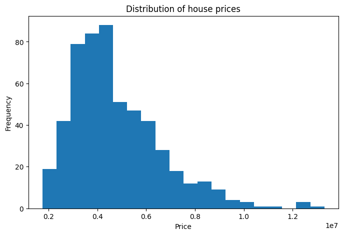
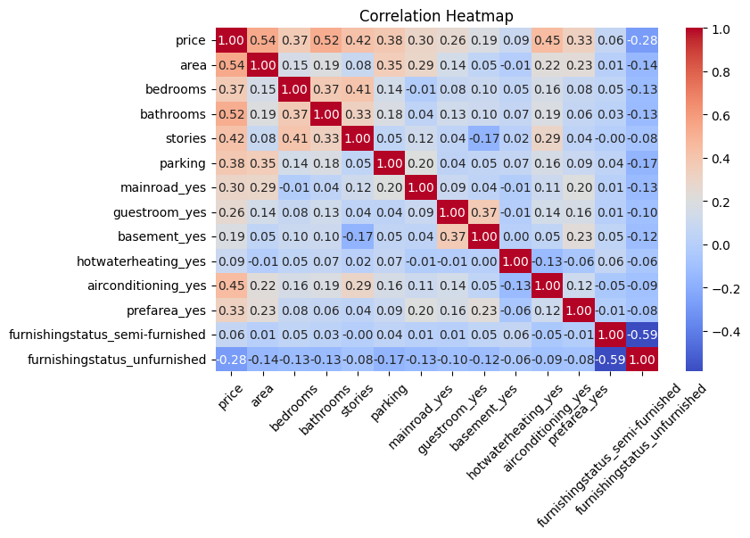
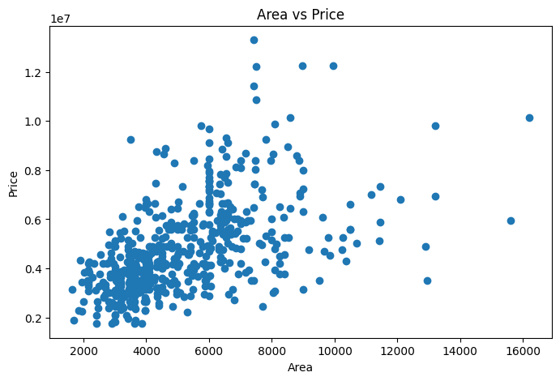
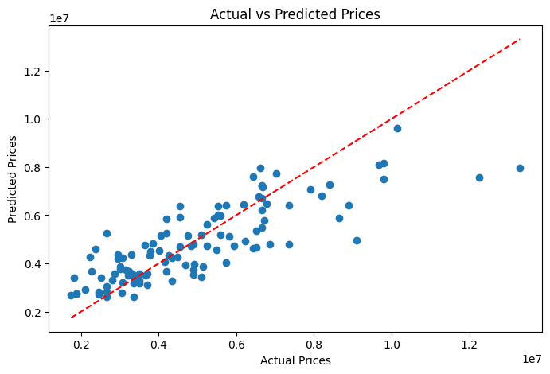
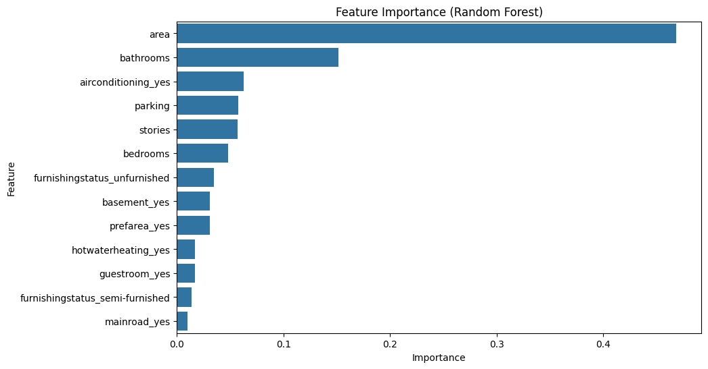

# Week 1 - Project

# House Price Prediction

## Week 1 Internship Project – XYlofy AI

This project was completed as part of the AI & Data Science Internship Program at XYlofy AI. The objective was to build and evaluate machine learning models capable of predicting house prices based on various property features such as area, bedrooms, bathrooms, parking, furnishing status, and amenities.

---

## Project Objectives

* Explore and understand the housing dataset.
* Clean and preprocess the data.
* Convert categorical variables into numerical form using One-Hot Encoding.
* Build regression models for house price prediction.
* Evaluate model performance using standard regression metrics.
* Visualize data patterns and model results.
* Generate business insights from the analysis.

---

## Dataset

**Housing Prices Dataset**
From Kaggle 
https://www.kaggle.com/datasets/yasserh/housing-prices-dataset

Features include:

* Area
* Bedrooms
* Bathrooms
* Stories
* Parking
* Main Road Access
* Guest Room
* Basement
* Air Conditioning
* Preferred Area
* Furnishing Status

**Target Variable:**

* Price

---

## Technologies Used

* Python
* Pandas
* NumPy
* Matplotlib
* Seaborn
* Scikit-Learn
* Jupyter Notebook

---

## Project Workflow

### Task 1 – Data Loading & Exploration

* Loaded dataset using Pandas
* Explored dataset structure
* Checked missing values
* Identified target and feature variables

### Task 2 – Data Cleaning & Preprocessing

* Removed duplicate records
* Applied One-Hot Encoding
* Converted categorical features into numerical format
* Prepared feature and target datasets

### Task 3 – Model Building

* Train-Test Split (80:20)
* Linear Regression
* Random Forest Regressor
* Performance Evaluation

### Task 4 – Data Visualization

* House Price Distribution
* Correlation Heatmap
* Area vs Price Analysis
* Actual vs Predicted Price Comparison
* Random Forest Feature Importance

### Task 5 – Insights & Business Recommendations

* Identified key factors affecting house prices
* Compared model performance
* Generated actionable recommendations

---

## Model Performance

| Model                   | MAE       | RMSE      | R² Score |
| ----------------------- | --------- | --------- | -------- |
| Linear Regression       | 970,043   | 1,324,507 | 0.653    |
| Random Forest Regressor | 1,021,546 | 1,400,566 | 0.612    |

### Best Performing Model

**Linear Regression**

The Linear Regression model achieved lower prediction errors and a higher R² score, making it the better-performing model for this dataset.

---

## Key Insights

* Area is the strongest predictor of house price.
* Bathrooms significantly influence property value.
* Air conditioning contributes noticeably to higher prices.
* Houses with more stories generally have higher market value.
* Parking availability positively impacts house prices.
* Unfurnished houses tend to have lower prices compared to furnished properties.

---

## Visualizations

### House Price Distribution



### Correlation Heatmap



### Area vs Price Relationship



### Actual vs Predicted Prices



### Feature Importance (Random Forest)



---

## Business Recommendation

Real estate businesses should focus on highlighting larger property areas, modern amenities, sufficient parking spaces, and air conditioning facilities while marketing homes, as these features have the strongest influence on property value.

---

## Repository Structure

```text
Week-1-House-Price-Prediction/
│
├── house_price_analysis.ipynb
├── Housing.csv
├── house_price_distribution.png
├── correlation_heatmap.png
├── area_vs_price_plot.png
├── actual_predicted_prices.png
├── feature_importance_rf.png
└── README.md
```

---

## Author

**Arthi Reddy**

AI & Data Science Intern – XYlofy AI

